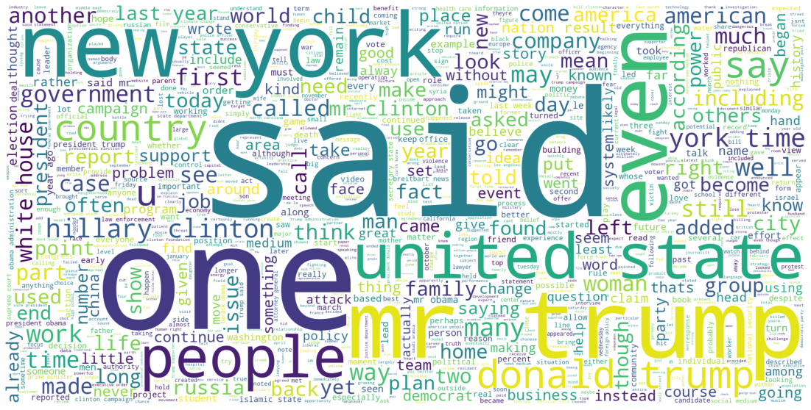

# Fake News Detection using ML

## Data Collection and Pre-processing

Data as a CSV file is collected from [Kaggle](https://www.kaggle.com/c/fake-news/data?select=train.csv). Data is pre-processed using,

```py
stop_words = stopwords.words('english')
lemma = WordNetLemmatizer()

def clean_text(text):
    text = text.lower() # lowering
    text = text.encode("ascii", "ignore").decode() # non ascii chars
    text = re.sub(r'\n',' ', text) # remove new-line characters
    text = re.sub(r'\W', ' ', text) # special chars
    text = re.sub(r'\s+[a-zA-Z]\s+', ' ', text) # single characters
    text = re.sub(r'\^[a-zA-Z]\s+', ' ', text) # single char at first
    text = re.sub(r'[0-9]', ' ', text) # digits
    text = re.sub(r'\s+', ' ', text, flags=re.I) # multiple spaces
    return ' '.join([lemma.lemmatize(word) for word in word_tokenize(text) if word not in stop_words])
```
---
## Word-Cloud Representation of Data



---

## Training and Testing Data

Whole data contains a total of `20,800` records, of which `15,600(75%)` are used for training and `5200(25%)` are for tesing purposes. Count of `1(unreliable)` label is `10,413(50.06%)` and count of `0(reliable)` label is `10,387(49.94%)`.

---

## Approaches

Three approaches are taken,

1. [Using only `text` and `label` columns to train and test.](Fake_News_Detection_using_ML.ipynb)
1. [Using `title`, `author` and `label` columns for training and testing.](Fake_News_Detection_using_ML_2.ipynb)
1. [Using `title`, `author`, `text` and `label` columns for training and testing.](Fake_News_Detection_using_ML_3.ipynb)

In each approach, `nan` values are filled with `titleunknown`, `authorunknown` and `textunknown` for `title`, `author` and `text` columns respectively (if required). During text-to-feature conversion period `TfidfVectorizer` is fitted on training data with `ngram_range=(1, 2)`. Then `PassiveAggressiveClassifier` is trained on training data and used to predict the testing data.

## Results

**Approach**|**1**|**2**|**3**
:-----:|:-----:|:-----:|:-----:
Tf-idf feature count |3,439,571|111,187|3,490,928
Accuracy  |0.9676923076923077|0.9957692307692307|0.9813461538461539
Precision |0.9749807544264819|0.9962034927866363|0.9865848984285167
Recall    |0.9609256449165402|0.9954476479514416|0.9764795144157815
F1-Score  |0.9679021780664883|0.9958254269449716|0.9815061963775024

---

## License

[MIT License](License.md)